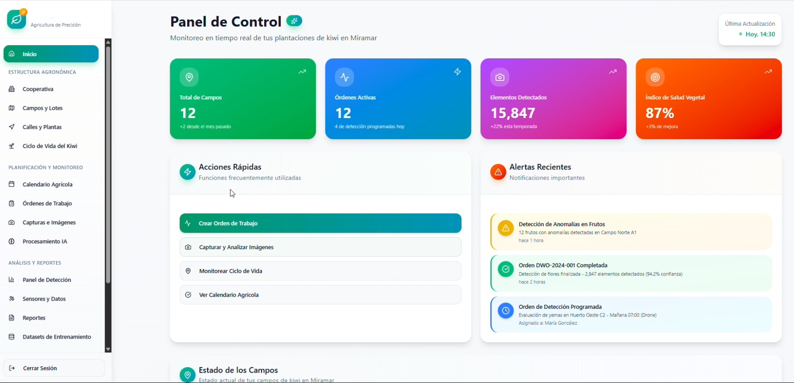
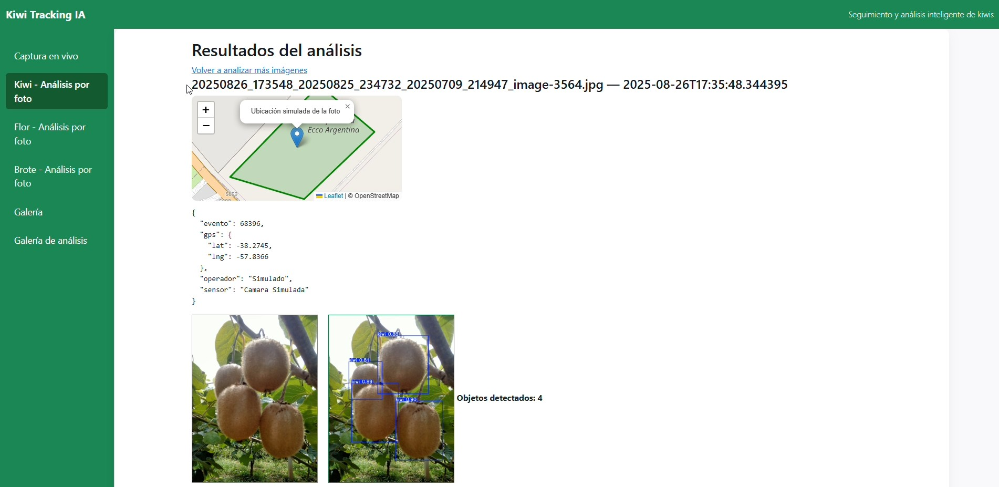
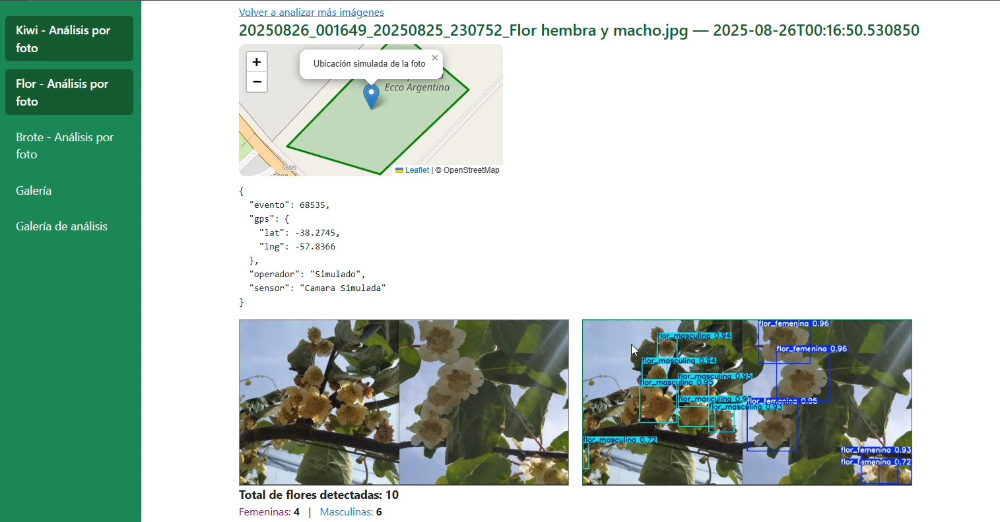

# Kiwi Tracking IA Lab

Laboratorio de visión por computadora aplicado al cultivo de kiwi.

Este repositorio documenta parte del trabajo realizado en el proyecto **KiwiTrackingIA**, orientado a explorar el uso de modelos de detección de objetos sobre imágenes de campo.

El objetivo fue analizar la posibilidad de detectar y contar elementos del ciclo productivo del kiwi, registrar capturas, asociarlas a recorridos y evaluar una arquitectura inicial para integrar imágenes, resultados de IA y trazabilidad.

## Estado del proyecto

Proyecto experimental / laboratorio técnico.

No representa un producto final ni una solución lista para producción. El repositorio está pensado para documentar el análisis realizado, las etapas previstas y las pruebas técnicas vinculadas al procesamiento de imágenes.

## Alcance trabajado

El análisis funcional contempló:

- conteo de ramas, yemas, brotes, flores y frutos;
- armado y organización de datasets para entrenamiento;
- detección de anomalías en frutos, hojas y posibles plagas;
- registro de recorridos y capturas de campo;
- asociación de imágenes con metadata como fecha, ubicación, operador, vehículo y sensor;
- procesamiento automático de imágenes mediante modelos de IA;
- trazabilidad entre recorridos, capturas, detecciones y resultados;
- reportes, visualización geográfica y consultas estadísticas.

## Enfoque técnico

El proyecto fue pensado por etapas:

1. Recolección y armado de datasets.
2. Entrenamiento inicial de modelos de detección.
3. Desarrollo de un MVP con API en Python/FastAPI.
4. Consolidación con base de datos geográfica y visualización.
5. Escalado futuro a infraestructura en la nube.

## Tecnologías consideradas

- Python
- FastAPI
- SQLite
- SQLAlchemy
- YOLO / Ultralytics
- OpenCV
- PostgreSQL / PostGIS
- GitHub
- Google Colab / AWS para entrenamiento futuro

## Resultados de entrenamiento

El repositorio incluye reportes de entrenamiento experimentales para distintas clases vinculadas al ciclo del kiwi:

- [Resumen de entrenamientos](training/resumen-entrenamientos.md)
- [Yemas](training/entrenamiento-yemas.md)
- [Brotes](training/entrenamiento-brotes.md)
- [Flor](training/entrenamiento-flor.md)
- [Kiwis](training/entrenamiento-kiwis.md)

Estos reportes incluyen métricas, curvas, matrices de confusión y ejemplos visuales de predicción.

## Capturas del proyecto

### Prototipo de gestión agrícola



### Detección y análisis de frutos



### Detección de flores masculinas y femeninas



## Documentación

- [Especificación resumida](docs/especificacion-resumida.md)
- [Arquitectura y etapas](docs/arquitectura-y-etapas.md)
- [Procesamiento de imágenes](docs/procesamiento-imagenes.md)

## Código representativo

La carpeta [`src/`](src/) contiene una selección de código representativo del prototipo KiwiTrackingIA.

Incluye componentes relacionados con FastAPI, integración con YOLO, OpenCV, procesamiento de imágenes, procesamiento de video y plantillas HTML utilizadas durante las pruebas.

Los modelos entrenados, datasets, capturas, videos y archivos generados no forman parte del código publicado.

## Estructura del repositorio

```text
docs/       Documentación funcional y técnica resumida
samples/    Espacio reservado para ejemplos de entrada y salida
src/        Código fuente representativo del prototipo
training/   Reportes de entrenamiento, métricas y resultados visuales
```
