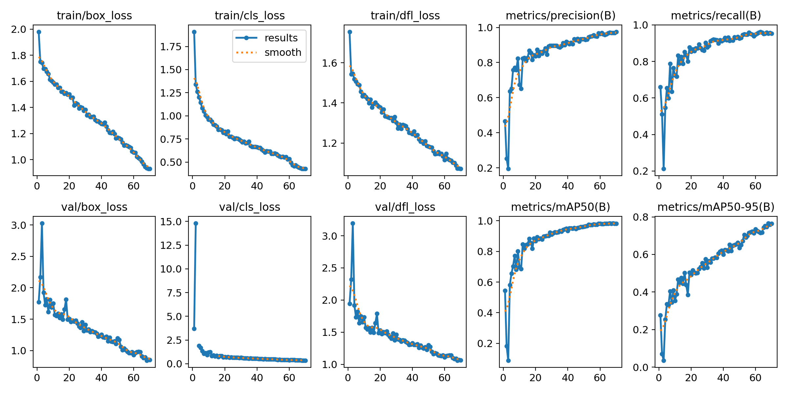
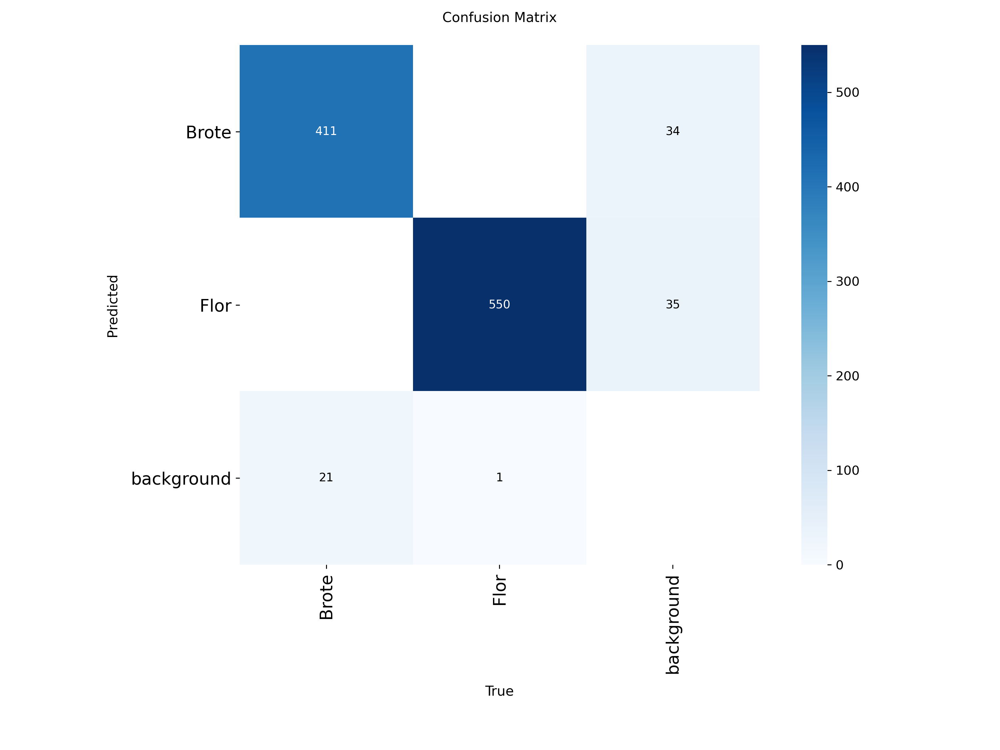
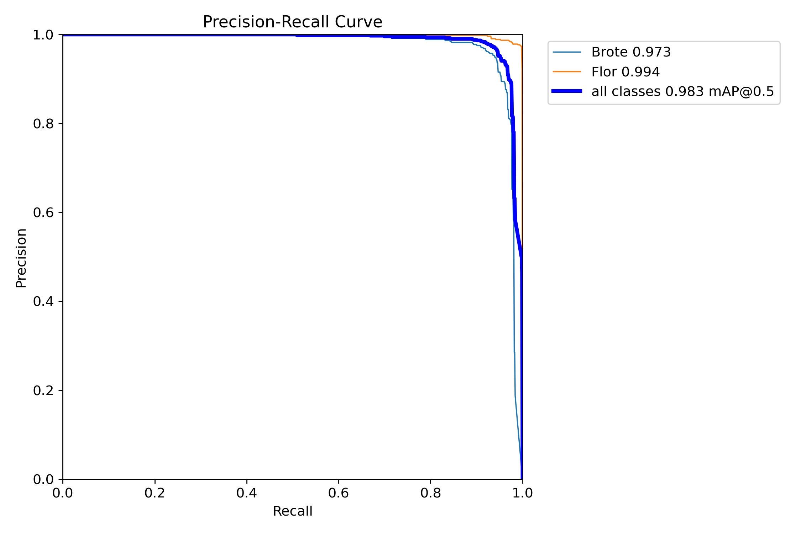
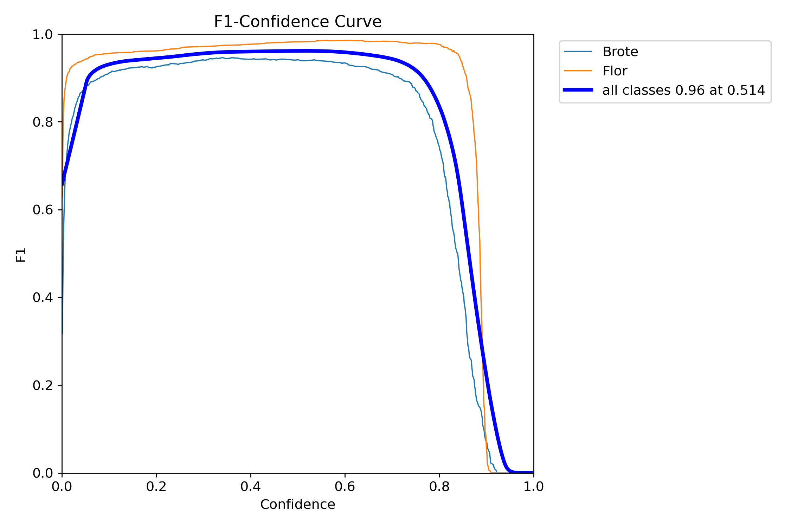
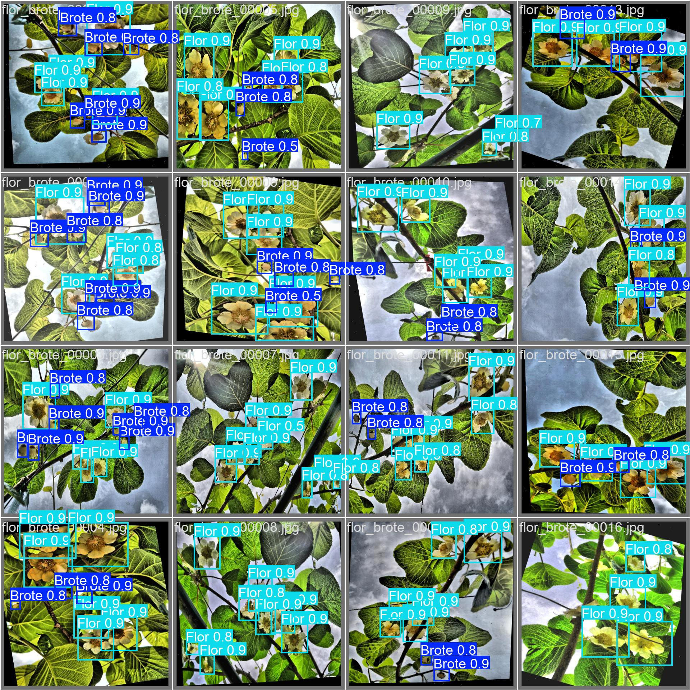
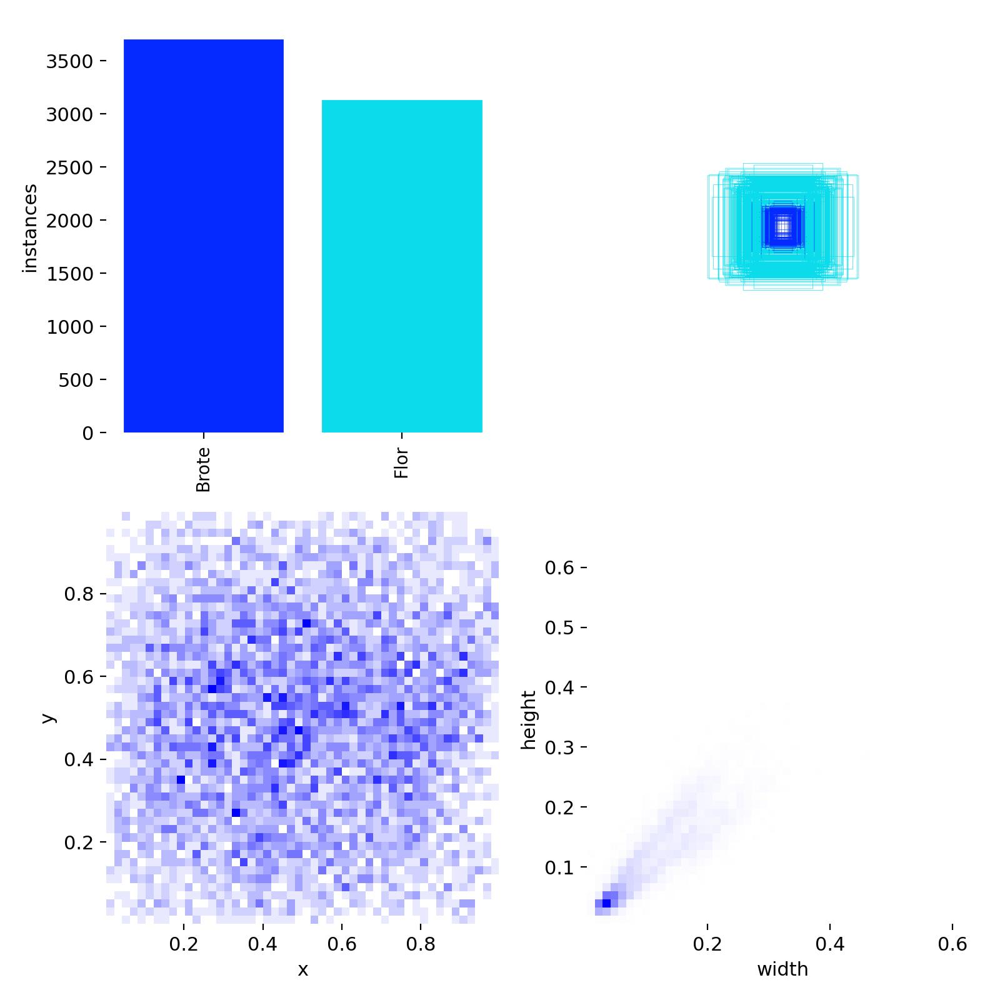

# Entrenamiento: Brotes

## Objetivo

Documentar las pruebas de entrenamiento realizadas para la detección de brotes en imágenes del cultivo de kiwi.

## Estado

Entrenamiento experimental.  
No representa un modelo final ni una solución lista para producción.

## Configuración general

| Dato | Valor |
|---|---:|
| Formato de resultados | YOLOv8/Ultralytics |
| Épocas registradas | 70 |
| Dataset completo | No incluido en este repositorio |
| Modelo entrenado | No incluido por tamaño/uso interno |
| Reportes gráficos | Incluidos en `docs/training/assets/` |

## Métricas finales

| Métrica | Valor |
|---|---:|
| Precision | 97.56% |
| Recall | 95.39% |
| mAP50 | 98.26% |
| mAP50-95 | 76.42% |

## Mejores valores observados

| Métrica | Valor | Época |
|---|---:|---:|
| Mejor mAP50 | 98.37% | 66 |
| Mejor mAP50-95 | 76.59% | 68 |

## Resultados visuales

### Evolución del entrenamiento

### Matriz de confusión

### Curva Precision-Recall

### Curva F1

### Ejemplo de predicción sobre validación

### Distribución de etiquetas

## Lectura técnica

El entrenamiento muestra resultados altos en las métricas principales. Para una etapa experimental, el dataset de brotes parece ser el más sólido de los cuatro, aunque debería validarse con imágenes nuevas tomadas en condiciones reales de campo.

## Observaciones

- Los resultados dependen de la calidad y cantidad de imágenes utilizadas.
- No se publica el dataset completo ni el modelo entrenado.
- Las métricas deben leerse como referencia de una etapa experimental.
- Para avanzar hacia una prueba más sólida, conviene validar con imágenes nuevas tomadas en campo y revisar falsos positivos/falsos negativos.

## Próximos pasos posibles

- Revisar ejemplos con falsos positivos y falsos negativos.
- Aumentar cantidad y variedad de imágenes.
- Mejorar consistencia de etiquetas.
- Separar datos de entrenamiento, validación y prueba final.
- Documentar una prueba de inferencia sobre imágenes no vistas.
