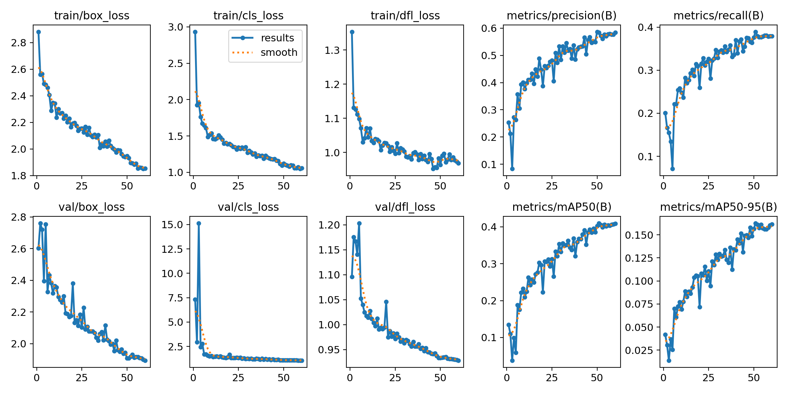
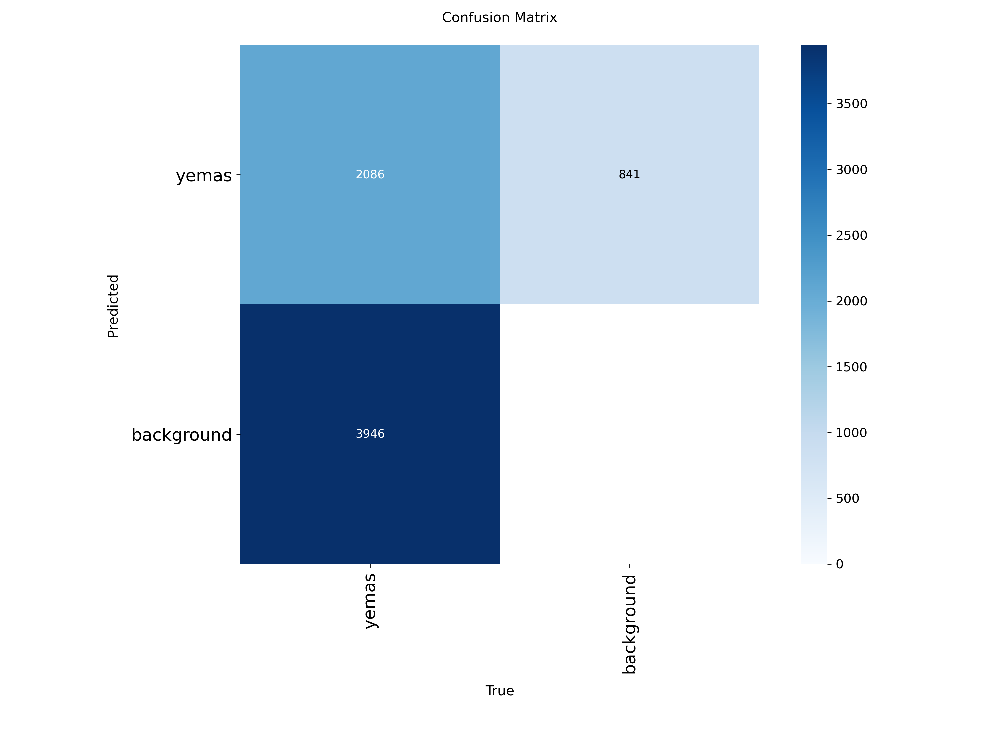
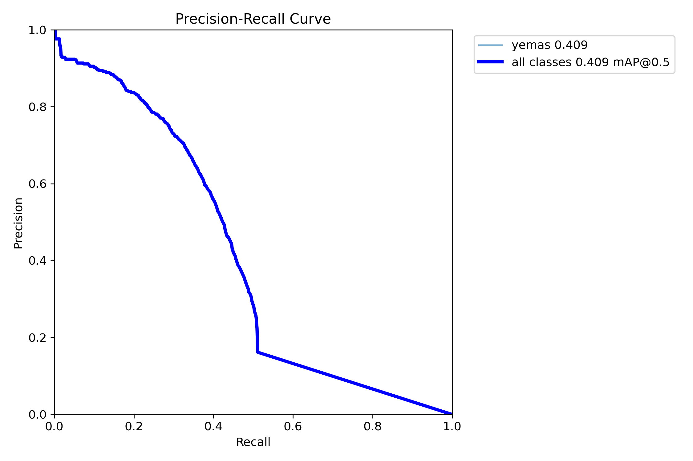
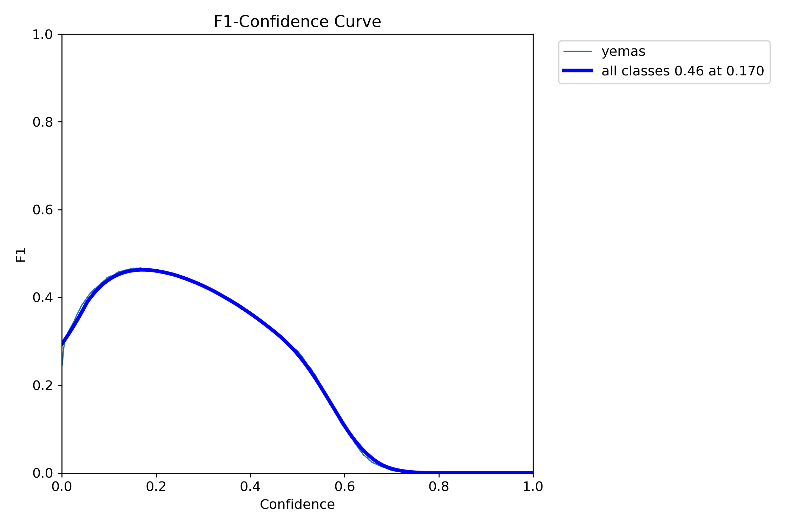
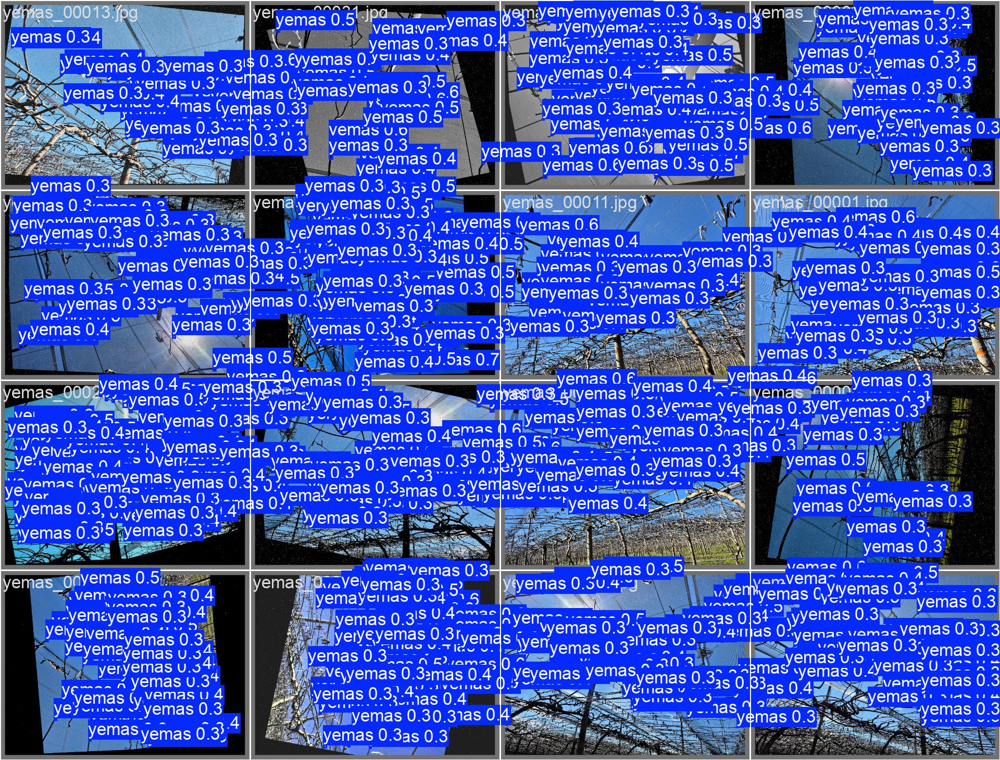
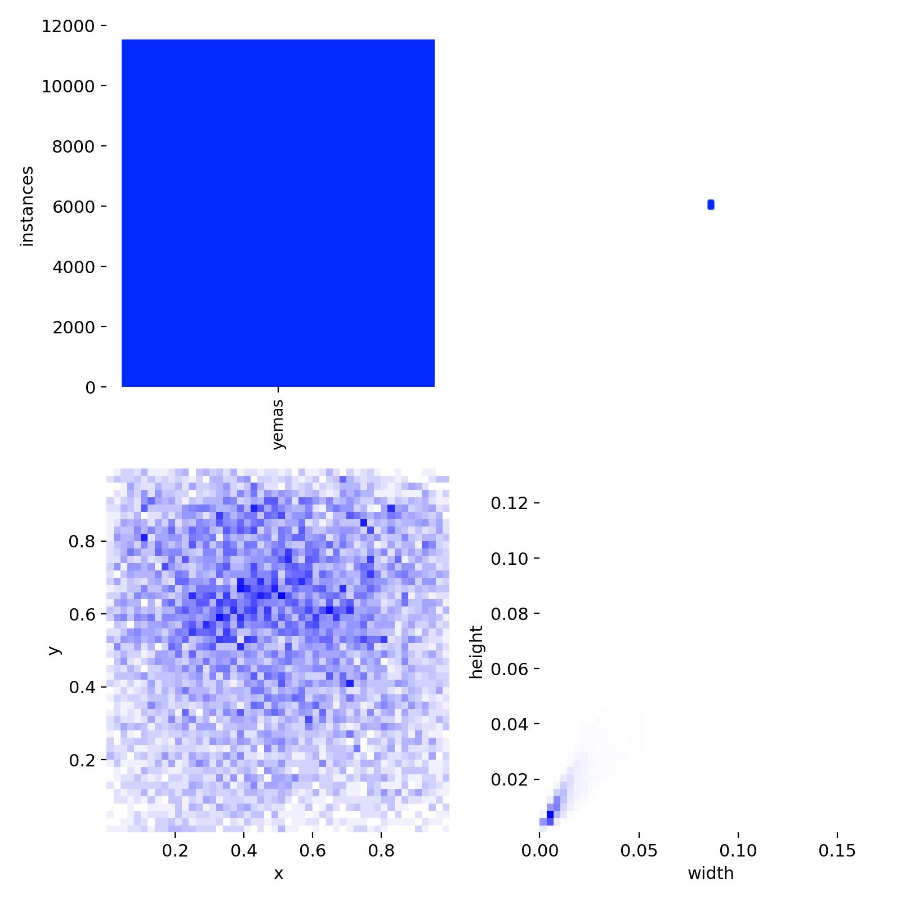

# Entrenamiento: Flor

## Objetivo

Documentar las pruebas de entrenamiento realizadas para la detección de flores en imágenes del cultivo de kiwi.

## Estado

Entrenamiento experimental.  
No representa un modelo final ni una solución lista para producción.

## Configuración general

| Dato | Valor |
|---|---:|
| Formato de resultados | YOLOv8/Ultralytics |
| Épocas registradas | 60 |
| Dataset completo | No incluido en este repositorio |
| Modelo entrenado | No incluido por tamaño/uso interno |
| Reportes gráficos | Incluidos en `docs/training/assets/` |

## Métricas finales

| Métrica | Valor |
|---|---:|
| Precision | 58.39% |
| Recall | 37.88% |
| mAP50 | 40.89% |
| mAP50-95 | 16.13% |

## Mejores valores observados

| Métrica | Valor | Época |
|---|---:|---:|
| Mejor mAP50 | 40.96% | 51 |
| Mejor mAP50-95 | 16.24% | 51 |

## Resultados visuales

### Evolución del entrenamiento

### Matriz de confusión

### Curva Precision-Recall

### Curva F1

### Ejemplo de predicción sobre validación

### Distribución de etiquetas

## Lectura técnica

El entrenamiento muestra un resultado bajo/intermedio. La clase flor requiere más trabajo de dataset y validación: mayor cantidad de imágenes, mejor diversidad de condiciones y revisión de etiquetas. Es útil como línea experimental, pero todavía no como modelo confiable.

## Observaciones

- Los resultados dependen de la calidad y cantidad de imágenes utilizadas.
- No se publica el dataset completo ni el modelo entrenado.
- Las métricas deben leerse como referencia de una etapa experimental.
- Para avanzar hacia una prueba más sólida, conviene validar con imágenes nuevas tomadas en campo y revisar falsos positivos/falsos negativos.

## Próximos pasos posibles

- Revisar ejemplos con falsos positivos y falsos negativos.
- Aumentar cantidad y variedad de imágenes.
- Mejorar consistencia de etiquetas.
- Separar datos de entrenamiento, validación y prueba final.
- Documentar una prueba de inferencia sobre imágenes no vistas.
