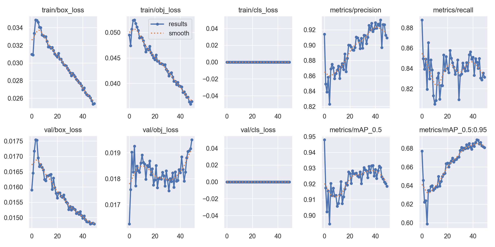
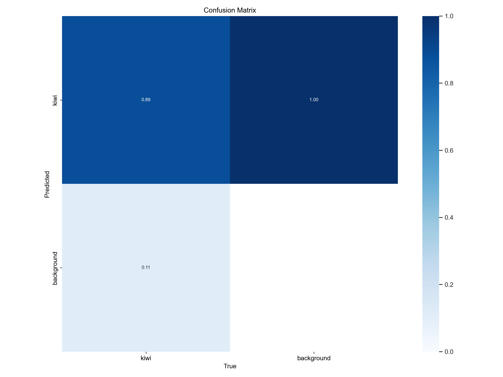
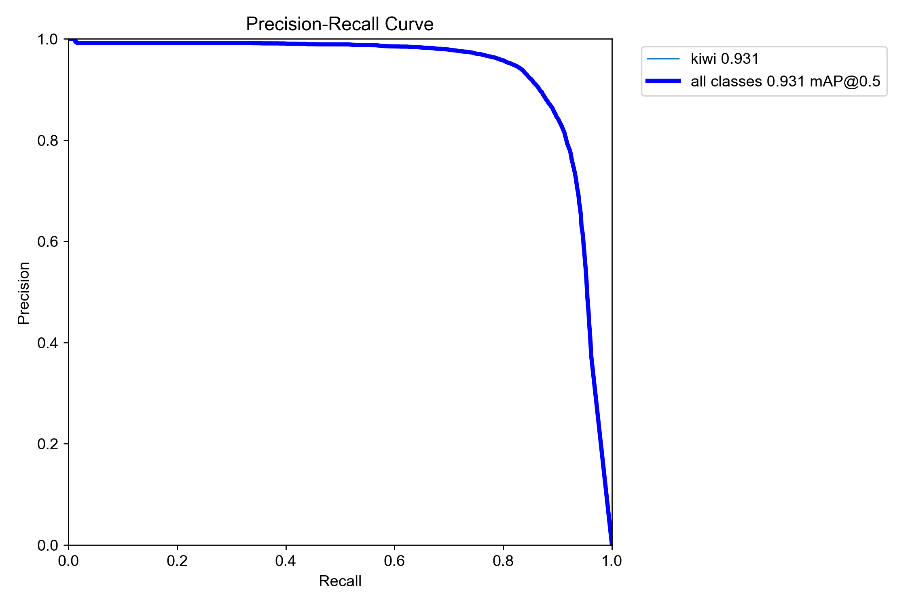
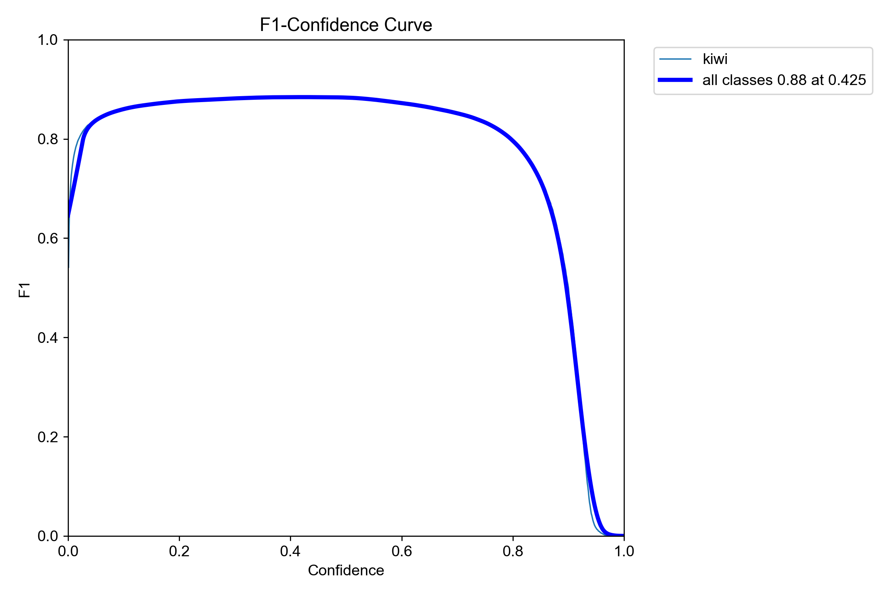
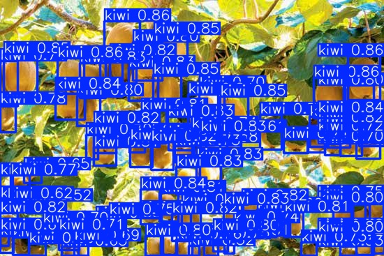
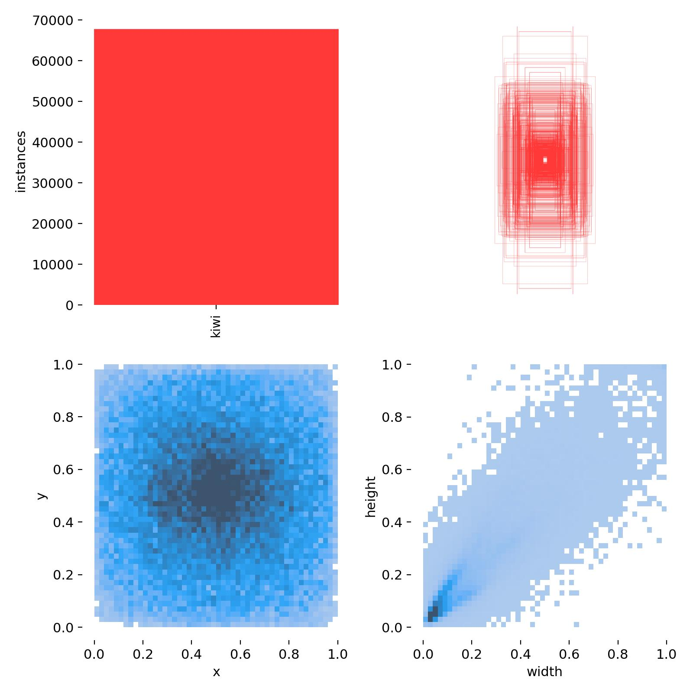

# Entrenamiento: Kiwis

## Objetivo

Documentar las pruebas de entrenamiento realizadas para la detección de frutos de kiwi en imágenes de campo.

## Estado

Entrenamiento experimental.  
No representa un modelo final ni una solución lista para producción.

## Configuración general

| Dato | Valor |
|---|---:|
| Formato de resultados | YOLOv5 |
| Épocas registradas | 50 |
| Dataset completo | No incluido en este repositorio |
| Modelo entrenado | No incluido por tamaño/uso interno |
| Reportes gráficos | Incluidos en `docs/training/assets/` |

## Métricas finales

| Métrica | Valor |
|---|---:|
| Precision | 90.94% |
| Recall | 83.13% |
| mAP50 | 91.84% |
| mAP50-95 | 68.09% |

## Mejores valores observados

| Métrica | Valor | Época |
|---|---:|---:|
| Mejor mAP50 | 94.80% | 0 |
| Mejor mAP50-95 | 68.92% | 43 |

## Resultados visuales

### Evolución del entrenamiento

### Matriz de confusión

### Curva Precision-Recall

### Curva F1

### Ejemplo de predicción sobre validación

### Distribución de etiquetas

## Lectura técnica

El entrenamiento muestra un desempeño bueno para detección de frutos. Es una buena base para una prueba de conteo y detección visual, aunque conviene seguir validando con imágenes de campo variadas, distintas condiciones de iluminación y frutos parcialmente ocultos.

## Observaciones

- Los resultados dependen de la calidad y cantidad de imágenes utilizadas.
- No se publica el dataset completo ni el modelo entrenado.
- Las métricas deben leerse como referencia de una etapa experimental.
- Para avanzar hacia una prueba más sólida, conviene validar con imágenes nuevas tomadas en campo y revisar falsos positivos/falsos negativos.

## Próximos pasos posibles

- Revisar ejemplos con falsos positivos y falsos negativos.
- Aumentar cantidad y variedad de imágenes.
- Mejorar consistencia de etiquetas.
- Separar datos de entrenamiento, validación y prueba final.
- Documentar una prueba de inferencia sobre imágenes no vistas.
