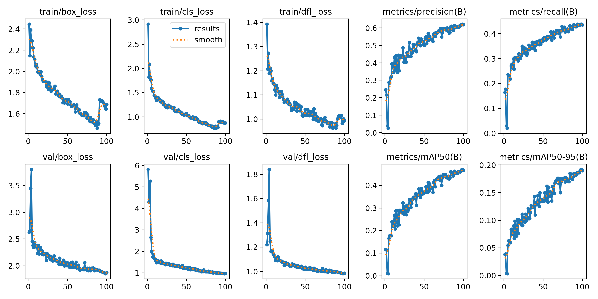
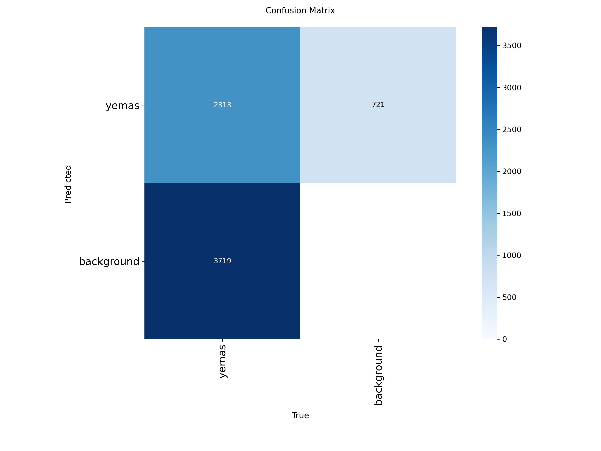
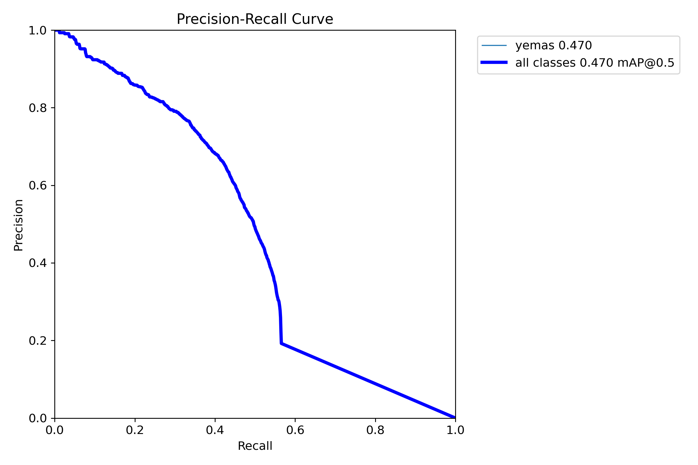
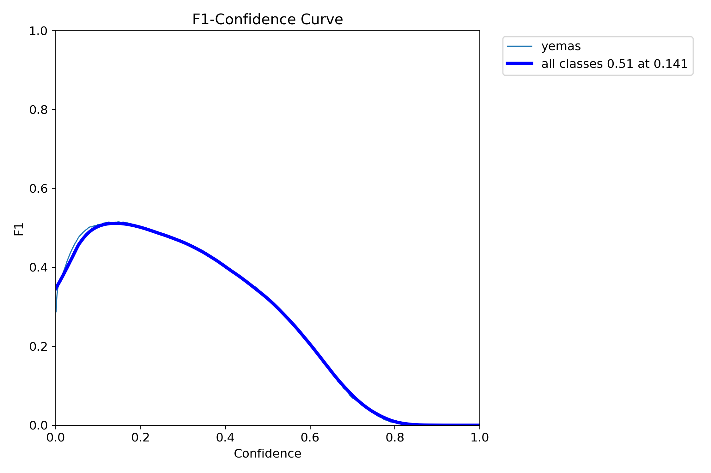
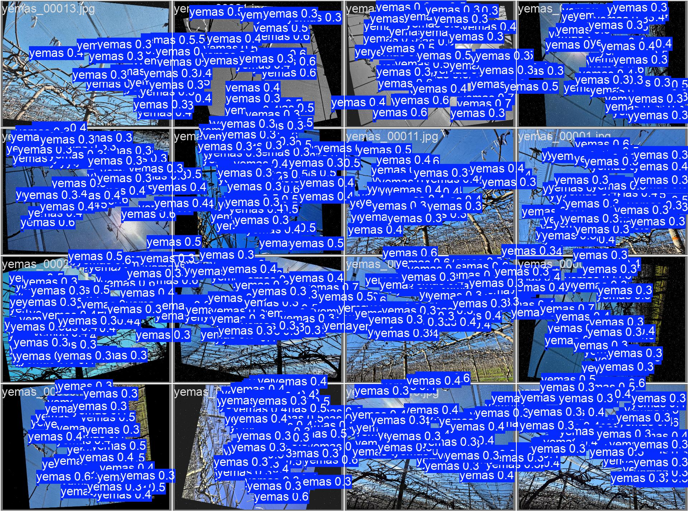
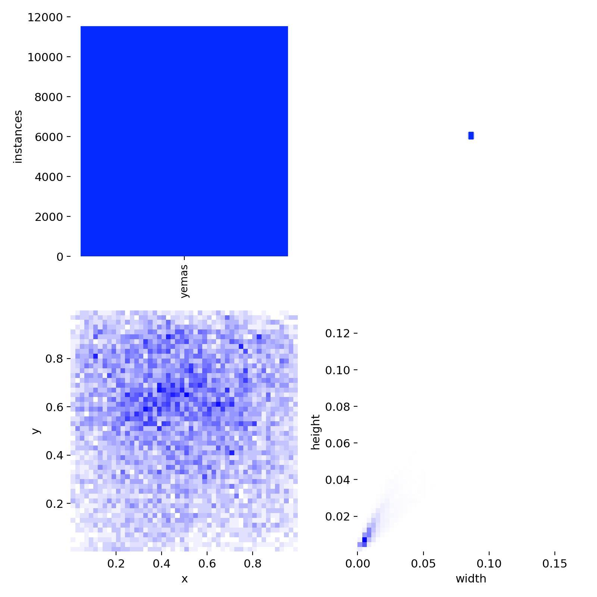

# Entrenamiento: Yemas

## Objetivo

Documentar las pruebas de entrenamiento realizadas para la detección de yemas en imágenes del cultivo de kiwi.

## Estado

Entrenamiento experimental.  
No representa un modelo final ni una solución lista para producción.

## Configuración general

| Dato | Valor |
|---|---:|
| Formato de resultados | YOLOv8/Ultralytics |
| Épocas registradas | 100 |
| Dataset completo | No incluido en este repositorio |
| Modelo entrenado | No incluido por tamaño/uso interno |
| Reportes gráficos | Incluidos en `docs/training/assets/` |

## Métricas finales

| Métrica | Valor |
|---|---:|
| Precision | 61.96% |
| Recall | 43.50% |
| mAP50 | 46.69% |
| mAP50-95 | 18.98% |

## Mejores valores observados

| Métrica | Valor | Época |
|---|---:|---:|
| Mejor mAP50 | 47.04% | 99 |
| Mejor mAP50-95 | 19.20% | 98 |

## Resultados visuales

### Evolución del entrenamiento

### Matriz de confusión

### Curva Precision-Recall

### Curva F1

### Ejemplo de predicción sobre validación

### Distribución de etiquetas

## Lectura técnica

El entrenamiento muestra un resultado intermedio/bajo. La detección de yemas parece más sensible a tamaño del objeto, calidad de imagen y consistencia del etiquetado. Antes de pensar en uso productivo, conviene reforzar dataset, revisar etiquetas y sumar más variabilidad de captura.

## Observaciones

- Los resultados dependen de la calidad y cantidad de imágenes utilizadas.
- No se publica el dataset completo ni el modelo entrenado.
- Las métricas deben leerse como referencia de una etapa experimental.
- Para avanzar hacia una prueba más sólida, conviene validar con imágenes nuevas tomadas en campo y revisar falsos positivos/falsos negativos.

## Próximos pasos posibles

- Revisar ejemplos con falsos positivos y falsos negativos.
- Aumentar cantidad y variedad de imágenes.
- Mejorar consistencia de etiquetas.
- Separar datos de entrenamiento, validación y prueba final.
- Documentar una prueba de inferencia sobre imágenes no vistas.
